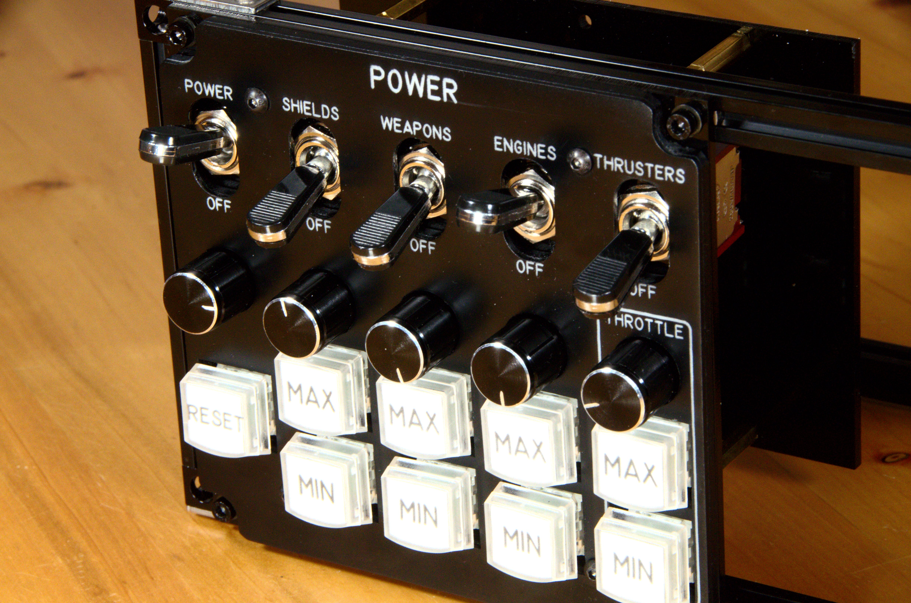

# Modular Cockpit for Star Citizen

## Motivation

1. [Star Citizen](https://robertsspaceindustries.com/star-citizen/) is a game with complex and rich functionality and interactivity.
1. Each ship in *Star Citizen* can play one or several roles.
1. Each player in *Star Citizen* can play one or multiple roles.
1. Each role has a particular form of interactivity.
1. Each player has a different way of playing.

Therefore each player needs a unique cockpit adapted to their way of playing. A modular, open and adaptable *Star Citizen* cockpit is needed.

## Modular

The "Modular Cockpit" has a modular architecture, obviously. And a module must comply with the following:

* Each module must work independently, to work it must not need other modules or other elements, with the exception of the computer.
* A module groups several related functions.
* A module is built with several components.
* All modules must meet the compatibility criteria (these are defined later).

### Definitions

*Frame*
: This is a structure created with [Makerbeam of 10x10 mm](https://www.makerbeam.com/makerbeam/) and has a height of 120 mm. For this, [100 mm long vertical *Beams*](https://www.makerbeam.com/makerbeam-100mm-16p-black-makerbeam.html) are used and they are joined to the [horizontal *Beams*](https://www.makerbeam.com/makerbeam/makerbeam-10x10mm-profile-lengths-anodised-in-blac/) with [*MakerBeam Corner Cube*](https://www.makerbeam.com/makerbeam-corner-cubes-12p-black-for-makerbeam.html). Several [*T-slot nuts*](https://www.makerbeam.com/makerbeam-t-slot-nuts-for-makerbeam-25p.html) are inserted into the horizontal *Beams*, which is where the *Modules* are screwed with M3 bolts. Any other compatible system can be used. For example the following is a *Frame* of 220 mm.

### Compatibility criteria

1. Each module should only have one USB connection.
1. A module must be able to be screwed to the *Frame*.

## Modules

The Button Box has a modular design. Each module corresponds to a set of related
functionalities.

1. [Power Module](modules/PowerModule/README.md)
1. [Camera Module](modules/CameraModule/README.md)
1. [Mining Module](modules/MiningModule/README.md)
1. [Emotes Module](modules/EmotesModule/README.md)
1. [Cockpit Module](modules/CockpitModule/README.md)
1. [Radar and Scanning Module](modules/RadarScanningModule/README.md)
1. [Torret Module](modules/TorretModule/README.md)
1. [Missiles Module](modules/MissilesModule/README.md)
1. [Docking and Landing Module](modules/DockingLandingModule/README.md)
1. [Movement Module](modules/MovementModule/README.md)
1. [Shields and Countermeasures Module](modules/ShieldsCountermeasuresModule/README.md)
1. [HUD Module](modules/HudModule/README.md)
1. [Weapons Module](modules/WeaponsModule/README.md)

## General Side View

